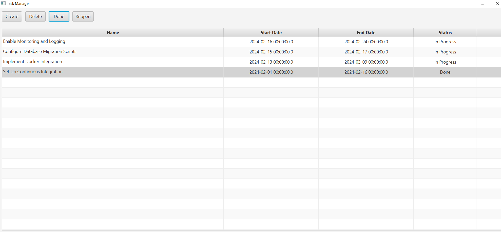
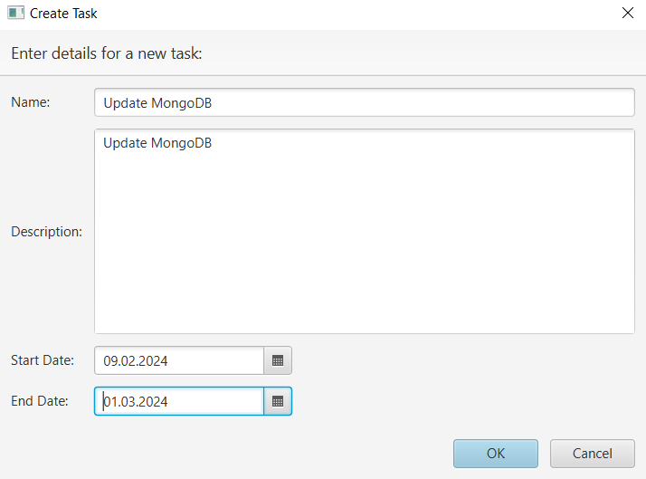
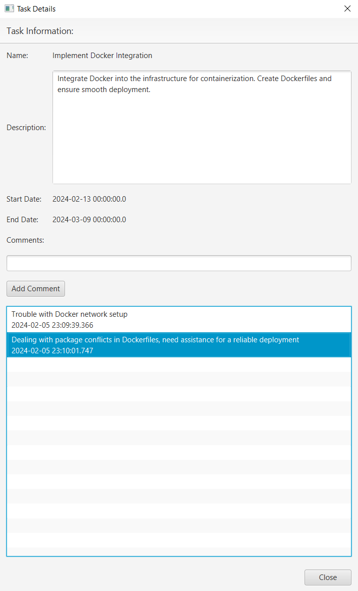

# How to Run

**Prerequisites:**
- [Java](https://www.java.com/), [JDK 21](https://www.oracle.com/java/technologies/downloads/#java21), [Maven 3.9.6](https://maven.apache.org/download.cgi) and [Git](https://git-scm.com/) installed.
- Ensure that the `JAVA_HOME` environment variable points to your installed JDK
- Add `path\to\your\maven\bin` to your PATH variable.

**Steps:**
1. **Clone the Repository:** <br>
   Open a terminal or command prompt and clone the Task Manager repository to your local machine.
    ```bash
    git clone https://github.com/cass1ope1a/desktop-taskmanager.git
    ```
2. **Navigate to the Task Manager project directory:** <br>
    ```bash
    cd desktop-taskmanager
    ```
3. **Run the Application:** <br>
    ```bash
    mvn clean javafx:run
    ```

## Features

### Viewing Task List:
- View and manage a persistent task list that remains after restarting the application. (Tasks are stored in `src/main/resources/tasks.json`)

### Creating New Tasks:
- Create new tasks and add them to the task list.

### Task Operations:
- Perform operations such as deleting, marking as done, reopening, and commenting on tasks.

### Detailed Task Information:
- View detailed information about the task


## Screenshots
*Main page of the Task Manager.*



<hr><br>

*Task creation form*



<hr><br>

*Task's detailed information*




<hr><br>

**Note**: This is an early version of the project, and certain features may be under development or incomplete